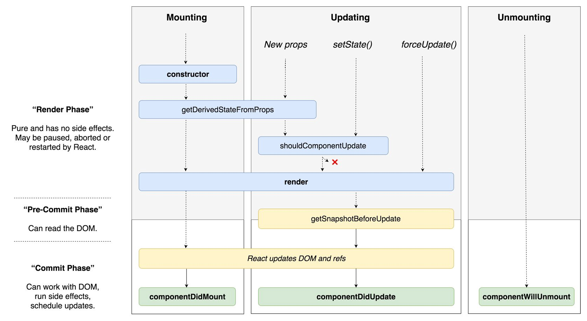

## React의 생명주기
- react에서 생명주기(lifecycle)란? component의 생성, 변경, 소멸 과정을 뜻한다.
- 컴포넌트가 생성, 변경, 소멸될 때 특정한 이벤트들이 발생한다.



## Mount
- 컴포넌트가 처음 실행될 때이다.
- 컴포넌트가 시작되면 context, defaultProps와 state를 저장한다.
- **render() 함수로 컴포넌트를 DOM에 부착**한 후, `componentDidMount()`가 호출된다.

## React의 생명주기에서 “생성” 과정에 속하는 함수

1. render()
2. constructor()
3. getDerivedStateFormProps()
4. componentDidMount()

### 1. render()

- render()는 return 되는 html 형식의 코드를 화면에 그려주는 함수이다.

### 2. constructor()

- 생명주기 함수 중 가장 먼저 실행되며, 처음 한 번만 호출된다.
- component 내부에서 사용되는 변수(state)를 선언하고 부모 객체에서 전달받은 변수(props)를 초기화 할 때 사용한다.
- constructor 함수를 사용할 때 super() 함수는 가장 위에 호출해야 한다.

ex ) 

```jsx
import React, { Component } from "react";

class LifecycleExample extends Component {
  constructor(props) {
    super(props);
    this.state = {};
    console.log("1. constructor Call");
  }

	render() {
    console.log("3. render Call");
    return <h2>[THIS IS CONSTRUCTOR FUNCTION]</h2>;
  }
}
export default LifecycleExample;

// 출력 1 -> 3
```

### 3. getDerivedStateFromProps()

- constructor() 함수 다음으로 실행된다.
- 컴포넌트가 새로운 props를 받게 됐을 때 state를 변경해준다.
- App.js에서 전달한 `prop_value`라는 변수를 `props.prop_value`로 접근해 값을 가져올 수 있다.

```jsx
import React, { Component } from "react";

class LifecycleExample extends Component {
  static getDerivedStateFromProps(props, state) {
    console.log("2. getDerivedStateFromProps Call : " + props.props_value);
    return {};
  }

  // 생성자 생략...

  render() {
    console.log("3. render Call");
    return <h2>[THIS IS CONSTRUCTOR FUNCTION]</h2>;
  }
}
export default LifecycleExample;

// 출력 1 -> 2 -> 3
```

### 4. componentDidMount()

- 생명주기 생성 함수들 중 가장 마지막으로 실행한다.
- **render() 함수가 return되는 html 코드를 화면에 그려준 후에 실행**되기 때문에, 이벤트 처리, 초기화 등 가장 많이 활용하는 함수이기도 하다.

```jsx
import React, { Component } from "react";

class LifecycleExample extends Component {
  static getDerivedStateFromProps(props, state) {
    console.log("2. getDerivedStateFromProps Call : " + props.props_value);
    return {};
  }

  constructor(props) {
    super(props);
    this.state = {};
    console.log("1. constructor Call");
  }

  componentDidMount() {
    console.log("4. componentDidMount Call");
    console.log("5. tmp_state : " + this.state.tmp_state);
  }

  render() {
    console.log("3. render Call");
    return <h2>[THIS IS CONSTRUCTOR FUNCTION]</h2>;
  }
}

export default LifecycleExample;

// 1 -> 2 -> 3 -> 4 -> 5
```

## 생명주기 “변경” 함수 shouldComponentUpdate()

- 컴포넌트의 변경 과정에 속하는데, 여기서 변경은 **props, state의 변경**을 뜻한다.
- shouldComponentUpdate() 함수의 반환 값에 따라 render() 함수의 실행을 제어할 수 있다.
    - `true : render() 실행, false : render() 취소`
    - props나 state 변수가 변경될 때 화면 렌더링을 제어할 수 있기 때문에 주로 여기서 **성능 최적화**를 하게 된다.

```jsx
import React, { Component } from "react";

class LifecycleExample extends Component {
  static getDerivedStateFromProps(props, state) {
    console.log("2. getDerivedStateFromProps Call : " + props.props_value);
    return {};
  }

  constructor(props) {
    super(props);
    this.state = {};
    console.log("1. constructor Call");
  }

  componentDidMount() {
    console.log("4. componentDidMount Call");
    console.log("5. tmp_state : " + this.state.tmp_state);
    this.setState({ tmp_state2: true });
  }

  shouldComponentUpdate(props, state) {
    console.log(
      "6. shouldComponentUpdate Call / tmp_state2 = " + state.tmp_state2
    );
    // return 값이 true일 경우 render() 함수를 한번 더 호출
    **return state.tmp_state2;**
  }

  render() {
    console.log("3. render Call");
    return <h2>[THIS IS CONSTRUCTOR FUNCTION]</h2>;
  }

  /**
   * [결과]
   * 1. constructor Call
   * 2. getDerivedStateFromProps Call : FromApp.js
   * 3. render Call
   * 4. componentDidMount Call
   * 5. tmp_state : undefined
   * 2. getDerivedStateFromProps Call : FromApp.js
   * 6. shouldComponentUpdate Call / tmp_state2 = true // update 후
   * 3. render Call // render가 한번 더 호출된다.
   */
}

export default LifecycleExample;
```

> **출처 )**  
초보자를 위한 리액트 200제  
[React의 생명 주기(Life Cycle)](https://www.zerocho.com/category/React/post/579b5ec26958781500ed9955)
>